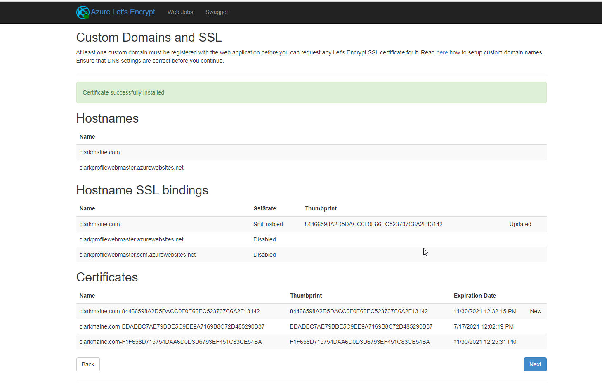

# SSL Cert requires renewal

## There is a let's Encrypt extension inside an azure function app service kudu console.

> Simply login [here](https://clarkprofilewebmaster.scm.azurewebsites)
> net/SiteExtensions/#installed) go to "Site Extensions" and run the
> extension "Azure Let's Encrypt".

Follow the default prompts and click "Next" finally press "Request and Install Certificat". Wait several minutes and it will be coompleted.
